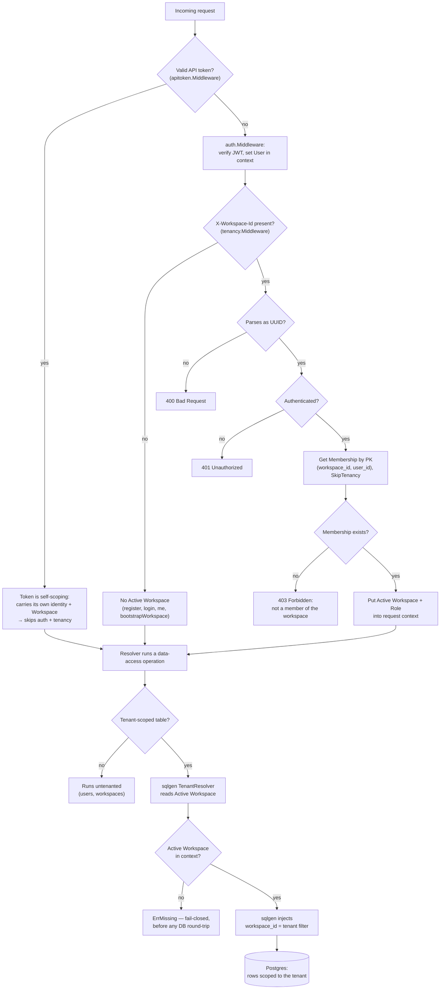

# Task Tracker — the sqlgen reference application

A multi-tenant SaaS task tracker built as the reference/example consumer of the
[`sqlgen`](https://github.com/teandresmith/sqlgen) code generator. The generated `internal/database` client is
only half the story; this repository is the other half — a runnable, end-to-end
GraphQL API that shows **how the generated pieces compose the blessed way**: JWT
auth with per-request Active Workspace selection, structural tenant scoping, a
Redis cache, NATS-backed events feeding an Activity projector, logging/authz
hooks, OpenTelemetry metrics, a data seeder, and twelve-factor configuration —
all runnable via `docker compose` and covered by full-stack integration tests.

If you are adopting sqlgen, copy the wiring in [`internal/appdb`](internal/appdb/appdb.go)
and [`cmd/server`](cmd/server/main.go) into your own project and adjust the
domain. This README walks that path and points at where the API surface is
documented.

- **Domain language:** [`CONTEXT.md`](CONTEXT.md) — the ubiquitous language (Workspace, User, Membership, Task, …).
- **Architecture decisions:** [`docs/adr/`](docs/adr/) — why GraphQL-only, why DDL-driven migrations, why testcontainers, etc.

---

## Quickstart

The backing services (Postgres, Redis, NATS, an OpenTelemetry collector) run in
Docker. The `Makefile` defaults the connection strings to match
`docker-compose.yml`, so the commands below need no environment setup for local
use.

```sh
make up        # start Postgres, Redis, NATS, and the OTel collector
make migrate   # apply ./migrations (also applied automatically by `make run`)
make seed      # populate a realistic multi-workspace dataset (optional)
make run       # start the GraphQL API on :8080
```

Then talk to the API:

- **GraphQL:** `POST http://localhost:8080/query` (schema introspection is enabled).
- **Health:** `GET http://localhost:8080/healthz` (pings the database).

Register to get a JWT, then found a Workspace:

```graphql
# 1. register returns { token } — an unauthenticated call
mutation { register(input: {email: "you@example.com", password: "password123", displayName: "You"}) { token } }

# 2. bootstrapWorkspace — send the token from step 1 as `Authorization: Bearer <token>`
mutation { bootstrapWorkspace(input: {name: "Acme", slug: "acme"}) { id } }
```

From then on, send the JWT as `Authorization: Bearer <token>` and select the
tenant with the `X-Workspace-Id: <workspace-id>` header. Every tenant-scoped operation is
**fail-closed**: with no valid Active Workspace it is rejected before touching
the database. (`make seed` prints ready-to-use Workspace ids and a shared login.)

---

## The blessed path (wiring walkthrough)

The whole boot sequence lives in [`cmd/server/main.go`](cmd/server/main.go)'s
`run`, and the request-time wiring in [`internal/server/server.go`](internal/server/server.go)'s
`New`. Read those two functions and you have seen the entire integration; the
sections below annotate each seam.

### 1. Configuration — `internal/config`

[`config.Load`](internal/config/config.go) reads the twelve-factor environment
once at startup and returns a validated `*Config`. The backing-service URLs and
the JWT secret are required (the server will not boot fail-open without them);
the OTel endpoint, listen address, and migrations directory are optional. See
[Configuration](#configuration) for the variables.

### 2. Migrations — `internal/migrate`

The `./migrations/*.up.sql` files are the **single source of truth** for the
schema (ADR-0002): they feed both `golang-migrate` and sqlgen's parser.
[`migrate.Up`](internal/migrate/migrate.go) applies them; the server runs it at
startup and `cmd/migrate` exposes it as a standalone step.

### 3. The client — `internal/appdb`

[`appdb.New`](internal/appdb/appdb.go) is the single, blessed construction path
for the data-access stack — the pgx pool, the Redis cache, the NATS bus, and the
`*database.Client` wired on top of them. **Both entrypoints that need a
production client — the server and the seeder (`cmd/seed`) — build it here**, so
they exercise byte-for-byte the same wiring:

```go
client := database.New(dbpgx.New(pool),
    database.WithTenantResolver(tenancy.Resolver()),   // structural workspace_id scoping
    database.WithMutationHook(authz.MutationHook()),   // role-based authorization
    database.WithCache(appCache),                      // read-through + invalidate-on-write
    database.WithEventPublisher(bus, ...),             // mutation events on Tx.OnCommit
)
```

Everything below is one of those four options, plus the request middleware that
feeds them.

### 4. Tenancy — `internal/tenancy`

Tenant scoping is the linchpin. [`tenancy.Middleware`](internal/tenancy/tenancy.go)
reads the `X-Workspace-Id` header, validates the authenticated caller's
Membership in that Workspace, and places the **Active Workspace** (and the
caller's Role) into the request context. [`tenancy.Resolver`](internal/tenancy/tenancy.go)
reads it back out at every tenant-scoped read/write, so sqlgen injects the
`workspace_id` filter automatically. Tenancy is **fail-closed** (`sqlgen.yml`
`tenancy.required: true`): no Active Workspace → the operation errors before a
database round-trip. `users` and `workspaces` are shared (untenanted).

The two halves — request middleware establishing the Active Workspace, and the
`TenantResolver` enforcing it at data-access time — flow like this:



### 5. Authorization — `internal/authz`

[`authz.MutationHook`](internal/authz/authz.go) runs in the client's hook chain
for every write. For the guarded tables — the ones that administer who has
access (Memberships, Invitations, Labels, Cycles, Teams, team_members, SSO
Connections) — it rejects callers whose Active-Workspace Role is below
owner/admin. Server-side bootstrap paths (`bootstrapWorkspace`,
`acceptInvitation`, the seeder) are self-authorized via `SkipTenancy` or an
unforgeable `WithSystemGrant` on the context.

### 6. Cache — `internal/cache`

[`cache.New`](internal/cache/cache.go) builds the generated `*database.Cache`
over a Redis backend, attached with `WithCache`. A single-entity `Get` is served
read-through; a mutation invalidates the affected entry. A cache outage never
breaks a request — the generated read-through routes backend errors through a
circuit breaker and falls through to Postgres.

### 7. Events & the Activity projector — `internal/events`

[`events.Connect`](internal/events/events.go) dials the NATS bus that the
generated mutation hooks publish to (attached with `WithEventPublisher`,
deferred to `Tx.OnCommit` so only committed writes fire). `ActorMetadata` stamps
the authenticated caller onto each event. [`events.NewProjector`](internal/events/projector.go)
subscribes and writes each event into the append-only **Activity** feed. Events
are disabled on the `activity` table itself (no events about the event log).

### 8. Observability — `internal/observability`

[`observability.Setup`](internal/observability/observability.go) installs the
global OpenTelemetry `MeterProvider`. Its `CacheRecorder` feeds the cache's
hit/miss/latency metrics and [`observability.Middleware`](internal/observability/http.go)
measures every HTTP request. Export is optional: an empty
`OTEL_EXPORTER_OTLP_ENDPOINT` yields a no-op provider.

### 9. The HTTP surface — `internal/server`

[`server.New`](internal/server/server.go) assembles the runnable handler and the
middleware chain (outermost first):

```
observability.Middleware            → per-request metrics
  apitoken.Middleware               → two front doors into the same inner handler:
    ├─ valid API token  ───────────────→ self-scoping; skips auth + tenancy
    └─ otherwise ─→ auth.Middleware   → JWT auth (identity)
                     tenancy.Middleware → Active Workspace selection
                                        → gqlgen server
gqlgen server: depth + complexity limits, typed error presenter
```

A request bearing a valid API token is dispatched straight to the inner handler
(the token is self-scoping — it carries its own Workspace and identity), so it
bypasses the JWT `auth` and `tenancy` middleware; every other request falls
through to the interactive JWT + `X-Workspace-Id` path.

Query-safety limits (`FixedComplexityLimit`, `FixedDepthLimit`) reject expensive
queries before they reach a resolver (`internal/server/limits.go`), and the
error presenter maps typed database errors to stable `extensions.code` values
(`internal/server/errors.go`). [`server.Serve`](internal/server/serve.go) adds
graceful shutdown on SIGINT/SIGTERM.

---

## The API surface — where it is documented

The GraphQL surface is described by three complementary, **generated** sources.
Start an adopter here:

| Source | Location | What it gives you |
| --- | --- | --- |
| **GraphQL schema** | [`internal/graph/*_gen.graphqls`](internal/graph/) | The self-describing SDL — every type, query, mutation, filter, and enum. The running server also serves introspection at `/query`. |
| **Data-model manifest** | [`internal/database/manifest/_index.md`](internal/database/manifest/_index.md) | The AI- and human-friendly manifest of the generated package: every entity, its columns, relationships, query/mutation methods, and the SQL each emits. Package-wide conventions (error sentinels, pagination, comparators, soft-delete, `CallOptions`, `omittable`) live in [`_conventions.md`](internal/database/manifest/_conventions.md). |
| **Breadcrumbs** | [`internal/database/AGENTS.md`](internal/database/AGENTS.md), [`internal/graph/AGENTS.md`](internal/graph/AGENTS.md) | Short indexes that tie the manifest, the schema, and the resolver semantics together, regenerated in place on each `make generate`. |

Regenerate all of them from the migrations + `sqlgen.yml` with:

```sh
make generate   # installs the pinned sqlgen CLI, regenerates the client, GraphQL, and manifest
```

Note how much of the write surface is deliberately **subtracted** from the API
in [`sqlgen.yml`](sqlgen.yml) (`api.operations` masks) and routed through blessed
resolvers instead — e.g. `createAPIToken`, `commentOnTask`, `addUserToTeam`. The
comments there explain each decision; it is a good tour of how to shape a safe
GraphQL surface over generated CRUD.

### Keeping the generated code honest

The `_gen` files are checked in, so they can silently rot if the migrations move
and nobody regenerates. `make verify` is the fast, Docker-free guard against that,
and it runs in [CI](.github/workflows/ci.yml) on every push and PR:

```sh
make verify            # go build + go vet + `sqlgen diff` (drift) + `sqlgen manifest validate`
make diff              # just the drift gate: fails if internal/database is stale vs ./migrations
make manifest-validate # validate the generated manifest against its JSON schema
```

`sqlgen diff` regenerates into a temp directory and diffs it against the committed
client, so a stale checkout fails the build with the exact files that would change.
The container-backed [integration suite](#testing) runs as a second CI job.

### Querying the surface from an AI agent (MCP)

`sqlgen` also serves the generated data-model surface over the **Model Context
Protocol**, so an agent can answer "what methods does `tasks` have?" or "what SQL
does `GetMany` emit?" without reading 50k tokens of generated Go.
[`.mcp.json`](.mcp.json) wires it for Claude Code / Cursor (it launches
`./bin/sqlgen`, installed at the version go.mod pins); install the CLI once, then
serve it directly:

```sh
make sqlgen   # install ./bin/sqlgen — what .mcp.json launches
make mcp      # serve the manifest over MCP on stdio
```

---

## Generated vs. hand-written — the boundary

The rule is a **filename convention, not a directory split**: files whose names
end in `_gen` (`*_gen.go`, `*_gen.resolvers.go`, `*_gen.graphqls`) are generated
by `sqlgen generate` and are **never edited by hand** — a regeneration would
overwrite your changes.

- **`internal/database/`** — entirely generated. The typed client, filters,
  inputs, enums, and the `manifest/` directory. Treat it as a compiled artifact.
- **`internal/graph/`** — **mixed**. The generated resolvers (`*_gen.resolvers.go`),
  the schema (`*_gen.graphqls`), the gqlgen exec/model, and the translate helpers
  carry the `_gen` suffix. The **blessed hand-written resolvers** — the ones that
  mint credentials, stamp provenance, and enforce tenant-safe writes — sit
  alongside them *without* the suffix (`auth.resolvers.go`, `api_token.resolvers.go`,
  `task_content.resolvers.go`, `membership_admin.resolvers.go`, …), plus the
  `Resolver` struct in `resolver.go`. sqlgen's merge step preserves these across
  regenerations.
- **Everything else is hand-written** and yours to own: `cmd/*` and the
  non-generated `internal/` packages — `appdb`, `auth`, `authz`, `cache`,
  `config`, `events`, `migrate`, `observability`, `server`, `tenancy`, `seed`,
  `apitoken`.

In short: **you write `cmd/` and the hand-written `internal/` packages (including
the un-suffixed resolvers); you never touch a `_gen` file.**

---

## Testing

The [`test/`](test/) package is a full-stack integration harness (ADR-0005): a
shared `TestMain` boots Postgres, Redis, and NATS in testcontainers, applies the
real migrations, and stands up the exact wired handler the server serves. Tests
drive the one seam — the GraphQL HTTP endpoint — so they read like a client of
the running service and exercise the real wiring, not a reconstruction of it.

```sh
make test        # full suite (needs Docker for testcontainers)
make test-short  # unit tests only (skips the container-backed integration tests)
```

---

## Configuration

Read once at startup by [`internal/config`](internal/config/config.go). Required
values have no safe default; the server names every missing one at once.

| Variable | Required | Default | Purpose |
| --- | --- | --- | --- |
| `DATABASE_URL` | yes | — | Postgres connection string (pgx pool + migrations). |
| `REDIS_URL` | yes | — | Redis connection string for the cache backend. |
| `NATS_URL` | yes | — | NATS connection string for the event bus. |
| `JWT_SECRET` | yes | — | Signs and verifies interactive-login JWTs. |
| `OTEL_EXPORTER_OTLP_ENDPOINT` | no | *(disabled)* | OpenTelemetry collector OTLP endpoint; empty disables export. |
| `LISTEN_ADDR` | no | `:8080` | HTTP listen address. |
| `MIGRATIONS_DIR` | no | `./migrations` | Directory of `*.up.sql` migrations applied at startup. |

The `Makefile` exports local defaults for all of these, so `make run` / `make
seed` work against `docker compose up` with no manual setup.

---

## Project layout

```
cmd/
  server/     # the API entrypoint: config → migrate → appdb → serve
  migrate/    # apply migrations as a standalone step
  seed/       # populate a realistic multi-workspace dataset
internal/
  database/   # GENERATED: the sqlgen client, types, and manifest/
  graph/      # GENERATED resolvers + schema, plus hand-written blessed resolvers
  appdb/      # the shared *database.Client construction (server + seeder)
  server/     # the http.Handler, middleware chain, limits, error mapping
  tenancy/    # Active Workspace middleware + TenantResolver (fail-closed)
  authz/      # role-based authorization mutation hook
  auth/       # JWT minting/verification + password hashing
  apitoken/   # API-token bearer middleware
  cache/      # Redis-backed sqlgen cache construction
  events/     # NATS bus + Activity projector
  observability/  # OpenTelemetry MeterProvider + HTTP metrics
  config/     # twelve-factor configuration
  migrate/    # golang-migrate runner
  seed/       # the seeding dataset
migrations/   # *.up.sql — the single source of truth for the schema
views/        # view annotations for sqlgen (CREATE VIEW is DDL-driven)
docs/adr/     # architecture decision records
```
